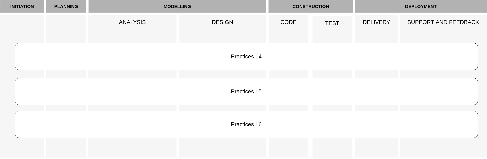

# Software Development Process <!-- omit in toc -->

- [1. Introduction](#1-introduction)
- [2. The Reference Process](#2-the-reference-process)
  - [2.1. Communication](#21-communication)
  - [2.2. Planning](#22-planning)
  - [2.3. Modelling](#23-modelling)
  - [2.4. Construction](#24-construction)
  - [2.5. Deployment](#25-deployment)
- [Development Team](#development-team)

## 1. Introduction

We are creating a software development process that can be followed by students at all levels as they work on both individual and group
assessments.
We're doing this because we want our students to use good practice, to undersatnd the software lifecycle and to become familiar with industry-standard tools.
We also want to develop a process that simplifes the management and assessment of students' work.

## 2. The Reference Process

We use the general framework from Pressman and Maxim to organise the activities, as presented in the figure below.
Each level of study has an specific set of guidelines, techniques and tools with appropriate depthness for the level.

The different stages are presented below, with links for their respective guidelines.
Rembember, these stages are simply used for helping organising and presenting the process, and should not be interpreted as a strict order.
In fact, each student is free to navigate over the stages as he/she sees fit.

### 2.1. Communication

The **communication** phase is dedicated to understanding the objectives of stakeholders, and for the design and collection of requirements that help identify the expected software functionalities and quality attributes.

- [**Communication guidelines**](communication/README.md)

### 2.2. Planning

The **Planning** phase is responsible for defining the scope of the project, the resources needed, the risks involved, a work schedule, and the resulting products.

- [**Planning guidelines**](planning/README.md)

### 2.3. Modelling

The **Modelling** phase is divided into analysis and design steps.
The **Analysis** is focused on the definition/formalisation of requirements, using artefacts like user stories and use cases.

The **Design** step is focused on the modelling of the solution.
It usually involves decision around architecture, data structure, user-interface, classes, algorithms, etc.

- [**Analysis guidelines**](modelling-analysis/README.md)
- [**Design guidelines**](modelling-design/README.md)

### 2.4. Construction

The **Construction** phase involves the implementation of the structures modeled in the design phase.
For this purpose, **code** and **tests** are conducted.

- [**Code guidelines**](construction-code/README.md)
- [**Tests guidelines**](construction-test/README.md)

### 2.5. Deployment

The **Deployment** involves the steps of **delivery** and **support and feedback**.

**Delivery** is focused activities associated with the ongoing DevOps practices.

**Support and feedback** step is driven by monitoring and maintenance activities.
This step also contains guidance regarding assessment, reports and presentations.
We also consider evaluation, reporting and reflection as part of this last step.

- [**Delivery guidelines**](deployment-delivery/README.md)
- [**Support and feedback guidelines**](deployment-support-feedback/README.md)

## Development Team

- Carlos Da Silva
- Soumya Basu
- Chris Bates
- James Harmson
- Brian Davis
