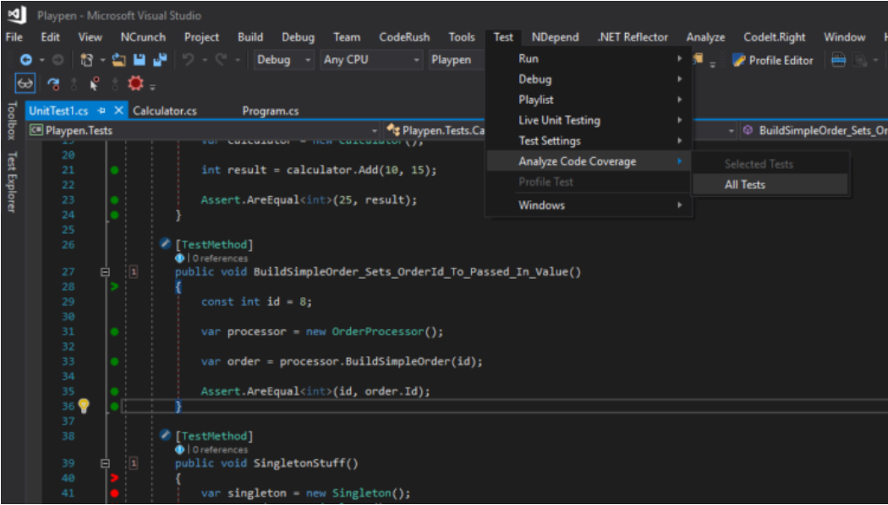

# Level 6 Code Review Guidelines

## 1. Abstract

This document will provide Level 6 students with more specific guidance on what is expected of you at this level in regards to code/peer reviews. 

## 2. Table of Contents

- [1. Abstract](#1-abstract)
- [2. Table of Contents](#2-table-of-contents)
- [3. What is expected](#3-what-is-expected)
- [4. Code Coverage](#4-code-coverage)
- [5. References](#5-references)

## 3. What is Expected

At Level 6, we expect you to use a code review tool such as SonarQube to conduct your code reviews. Some other tools (as well as SonarQube) which we recommend you take a look at can be seen below:

* [SonarQube](https://www.sonarqube.org/)
* [Review Board](https://www.reviewboard.org/)
* [Github](https://github.com/features/code-review/)
* [Crucible](https://www.atlassian.com/software/crucible)
* [UpSource](https://www.jetbrains.com/upsource/)

If you click on these links, they will take you to their official pages where you can find documentation on how to download them, as well as how to use them effectively. There is no 'best tool', so try a few out, and see which your team are most comfortable using. You are also free to use the other three techniques: **The Email Thread**, **Pair Programming** or **Over-the-Shoulder**, however we would prefer you to use a tool at Level 6, especially for your CSSD module.
These techniques are outlined in more detail in the main [README file](../README.md), along with how to conduct good code reviews, and why they are important. So navigate to there if you have not read through that document yet.

Then end goal is to:

* Make sure there are no bugs in your code. 
* Minimise your chances of having issues.
* Confirm the code adhears to guidelines.
* Increase the efficiency of the program. 
* Make sure the new code is actually an improvement over the old code base (and meets the requirements of the client). 

For more information on how to conduct good code reviews, look at references 1, 2 and 3.

At Level 6, it will also be nice to see **Code Coverage** depending on the module.

## 4. Code Coverage

Code coverage is a metric that can help you understand how much of your source is tested. It is a measurement of how many lines/blocks/arcs of your code are executed while automated tests are running. Since automated tests are preferred at Level 6, this is why we are introducing this here.

The common metrics that you might see in code coverage reports include:

* Function coverage: how many of the functions defined have been called.
* Statement coverage: how many of the statements in the program have been executed.
* Branches coverage: how many of the branches of the control structures (e.g. if statements) have been executed.
* Condition coverage: how many of the boolean sub-expressions have been tested for a true and a false value.
* Line coverage: how many of lines of source code have been tested.

These metrics are usually represented as the number of items actually tested, the items found in your code, and a coverage percentage (items tested / items found).

There are many tools available to you for code coverage. Some of these include:

* Java: Atlassian Clover, Cobertura, JaCoCo
* Javascript: istanbul, Blanket.js
* PHP: PHPUnit
* Python: Coverage.py
* C#: Visual Studio Code coverage, ReSharper's dotCover

Gathered from reference [4].

A screenshot of how to use Visual Studio 2019 for code coverage can be seen here:

*by ndepend: https://blog.ndepend.com/guide-code-coverage-tools/*

Code coverage will help you improve the efficiency of your programs. As previously mentioned, it is not essential, but would be nice to see at Level 6.

## 5. References

[1] SmartBear. What is Code Review?. <https://smartbear.com/learn/code-review/what-is-code-review/>.

[2] Kinsta. 12 Best Code Review Tools for Developers (2021 Edition). <https://kinsta.com/blog/code-review-tools/>.

[3] Perforce. 9 Code Review Best Practices. <https://www.perforce.com/blog/qac/9-best-practices-for-code-review>.

[4] Atlassian. An introduction to code coverage. <https://www.atlassian.com/continuous-delivery/software-testing/code-coverage>.
