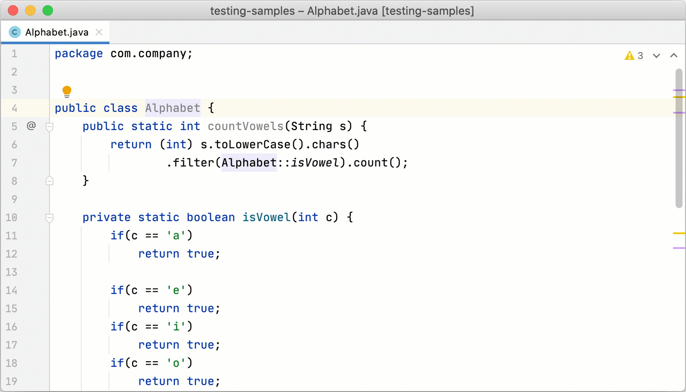

# Testing - Level 5 <!-- omit in toc -->

## 1. Introduction

Unit Testing is a type of software testing where individual units or components of a software are tested. The purpose is to validate that each unit of the software code performs as expected. Unit Testing is done during the development (coding phase) of an application by the developers. Unit Tests isolate a section of code and verify its correctness. A unit may be an individual function, method, procedure, module, or object. At Level 5, the expectation is that you will do **Unit Testing** that makes use of a framework and is performed within the IDE. Manual testing and the concept of Unit Testing was covered in the Level 4 Testing document found [here](../level-4/level4-testing.md).

    - Within the IDE
      - IntelliJ
        - Java
        - Web Development
          - PHP
          - Node  
      - Visual Studio
        - C++
        - C#

## 2. Table of Contents

- [1. Introduction](#1-introduction)
- [2. Table of Contents](#2-table-of-contents)
- [3. Testing within the IDE](#3-testing-within-the-ide)
  - [3.1. Performing Tests in IntelliJ](#31-performing-tests-in-intellij)
    - [3.1.1. Preparing for Tests](#311-preparing-for-tests)
    - [3.1.2. Create Tests](#312-create-tests)
      - [Add a new Test](#add-a-new-test)
  - [4.2. Performing Tests in Visual Studio](#42-performing-tests-in-visual-studio)
- [5. References](#5-references)
  
## 3. Testing within the IDE

### 3.1. Performing Tests in IntelliJ

#### 3.1.1. Preparing for Tests

IntelliJ IDEA works with multiple testsing frameworks out of the box such as JUnit or TestNG. Inside the IDE you can create a test class directly from the source code together with the necessary testmethods. You can switch between test classes and source code with a shortcut, run multiple tests, view statistics for each test, and export test results for a file.

#### 3.1.2. Create Tests

The simplest way of creating a new test class in IntelliJ IDEA is by using a dedicated intention action that you can invoke from your source code. In this case, the IDE creates a new test class and generates test code for this class, package, or function.

##### Add a new Test

1 - In your production code, place the caret at the class for which you want to create a test, press `Alt+Enter`, and select **Create Test**.  
2 - In the **Create Test** dialog, select the library that you want to use. If you don't have the necessary library yet, you will be prompted to download it. To do that, click **Fix**.  

```
If you're using Maven, the IDE will add the missing dependencies to your pom.xml.  
For Gradle projects, add the necessary dependencies manually.
```

More information to add them manually [here](https://www.jetbrains.com/help/idea/testing.html#add-testing-libraries)  
3 - Configure the test class name and its location and select the methods that you want to test. Click **OK**.  
As a result, IntelliJ IDEA creates a new test class with the specified name and generated test methods in the **Test Sources Root**.



### 4.2. Performing Tests in Visual Studio

## 5. References

[Guru99: Unit Testing Tutorial](https://www.guru99.com/unit-testing-guide.html)  
[DZone Unit Testing Guidelines: What to Test and What Not To Test](https://dzone.com/articles/unit-testing-guidelines-what-to-test-and-what-not)  
[Guru99: Automated Testing vs Manual Testing](https://www.guru99.com/difference-automated-vs-manual-testing.html)  
[JetBrains IntelliJ IDEA Testing](https://www.jetbrains.com/help/idea/testing.html)  
[TutorialsPoint: IntelliJ Idea - Unit Testing](https://www.tutorialspoint.com/intellij_idea/intellij_idea_unit_testing.htm)  
