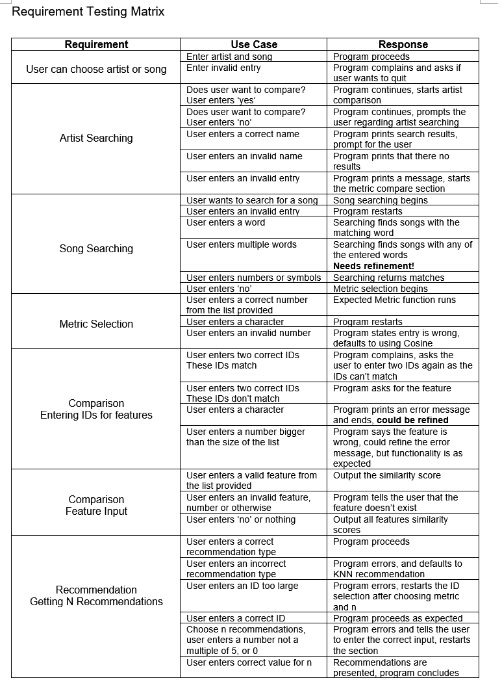
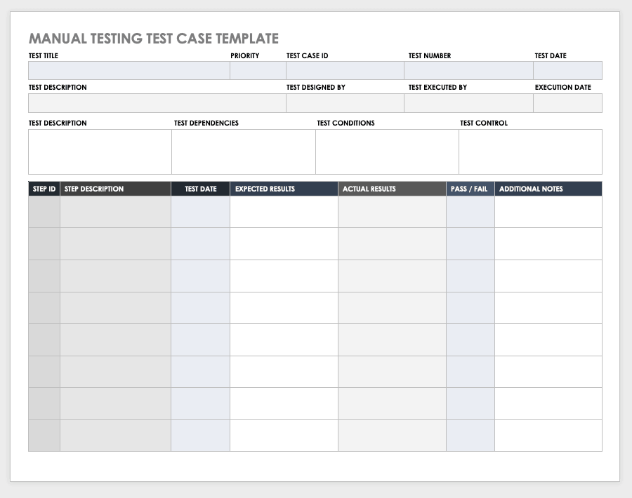

# Testing - Level 4

## 1. Introduction
Unit Testing is a type of software testing where individual units or components of a software are tested. The purpose is to validate that each unit of the software code performs as expected. Unit Testing is done during the development (coding phase) of an application by the developers. Unit Tests isolate a section of code and verify its correctness. A unit may be an individual function, method, procedure, module, or object. At Level 4, the expectation is that you will at least do **manual testing** when you are conducting Unit Testing for your software, which can be done by hand if you prefer as long as all your testing is recorded as you go.

## 2. Table of Contents
- [3. Unit Testing](#3-unit-testing)
  - [3.1. Benefits of Unit Testing](#31-benefits-of-unit-testing)
  - [3.2. What should you test?](#32-what-should-you-test)
  - [3.3. What shouldn't you test?](#33-what-shouldnt-you-test)
  - [3.4. Pros and Cons](#34-pros-and-cons)
  - [3.5. Keeping Track](#35-keeping-track)
- [4. References](#4-references)  

## 3. Unit Testing
In most cases, Unit testing are not an effective way to find bugs in your code. They are more effective in examining each unit within your code separately. When you run your application for real, all those units have to work together, and the whole is more complex and subtle than the sum of its independently-tested parts. Defects in an individual component may bear no relationship to the symptoms an end user would experience and report, since you aree designing the preconditions for your unit tests, they won't ever detect problems triggered by preconditions that you didn't anticipate. Unit tests can be effective at detecting in one instance though, and that is when you are re-factoring your code without meaning to change it's behaviour. In this case, tests can often tell you if the unit's behaviour has changed.

### 3.1. Benefits of Unit Testing
When we think about why we should be conducting Unit Tests, it is important to have an understanding as to why they are necessary, and the benefits of them.
* They prove your code actually works
* You get a low-level regression-test suite
* You can improve the design without breaking it
* It's more fun to code with them than without them
* They demonstrate concrete progress
* They are a form of sample code
* It forces you to plan before you code
* It reduces the cost of bugs
* It's even better than code inspections
* Unit tests make designs better

### 3.2. What should you test?
So now you know the benefits of conducting Unit testing, the next thing to think about is, what should you test? These include.
* Collections passed as parameter not changed in the method
* Algorithm Engines
* Utility methods
* Core business logic methods
* Simple DB queries checking predicates
* Services that are high-risk

### 3.3. What shouldn't you test?
We know what we should be testing, but how about what we shouldn't be?
* Constructors or properties (if they just return variables). Test them only if they contain validations.
* Configurations like constants, readonly fields, configs, enumerations, etc.
* Facades of just wrapping other frameworks or libraries
* Container service registrations
* Exception messages
* POCO classes — models, etc.
* .NET Core/Framework logic- like default parameters
* Private methods directly
* Complex SQL Queries (more than 3 joins or grouping, etc.). Better to test it with manual or some kind of system test against real DB.
* ASPNET.Core controller methods
* Complex multi-threading code (it is better to be tested with integration tests)
* Methods that call another public method

### 3.4. Pros and Cons
* Pros
  * Get fast and accurate visual feedback
  * It is less expensive as you don't need to spend your budget fro the automation tools and process
  * Human judgment and intuition always benefit the manual element
  * While testing a small change, an automation test would require coding which could be time-consuming, while you could test manually on the fly
  
* Cons
  * Less reliable testing method because it's conducted by a human. Therefore, it is always prone to mistakes and errors
  * The manual testing process can't be recorded, so it is not possible to reuse the manual test
  * In this testing method, certain tasks are difficult to perform manually which may require an additional time of the software testing phase
  
### 3.5. Keeping Track
As you will most likely be doing your Unit Testing at this level by hand, to keep track of this it is better to use some form of document like a testing table to help organise the tests you have done, what you need to do, and what needs to be done, along with recording results. There might be failures in your tests that require you to make adjustments to your program, especially if these failures can impact on the performance of your program.  

Here we will provide you a couple of readily available ideas. One of them is a simple requirement testing table I did for a past assignment, and another is a suitable template I found online. It is preferable you label your tests with appropriate IDs, so with this in mind, modifying the examples here can be done if you prefer. These examples can be seen below, and found [here](../level4).

  
   

  

## 4. References
- [1] Guru99: Unit Testing Tutorial <https://www.guru99.com/unit-testing-guide.html>
- [2] DZone Unit Testing Guidelines: What to Test and What Not To Test <https://dzone.com/articles/unit-testing-guidelines-what-to-test-and-what-not>
