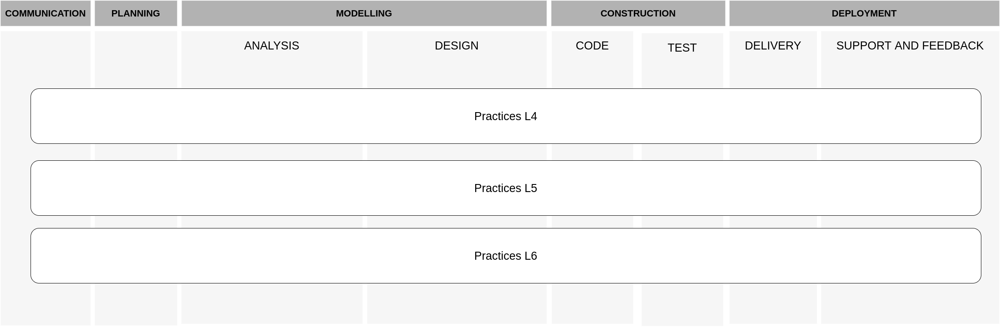

# Software Process Lifecycle

## Introduction

This is where you will find all information in relation to the Software Process Lifecycle.  

We use the general framework from Pressman and Maxim to organise the activities, as presented in the figure below.
Each level of study has an specific set of guidelines, techniques and tools with appropriate depthness for the level.

- **[Communication](#communication)** phase is dedicated to understanding the objectives of stakeholders, and for the design and collection of requirements that help identify the expected software functionalities and quality attributes.
- **[Planning](#planning)** phase is responsible for defining the scope of the project, the resources needed, the risks involved, a work schedule, and the resulting products.
- **[Modelling](#modelling)** phase is divided into analysis and design steps.
  - **Analysis** (of requirements)
    - User stories, Use cases
  - **Design** (of the solution)
    - Data structure, user-interface, classes, algorithms
- **[Construction](#construction)** phase involves the implementation of the structures modeled in the design phase. For this purpose, **code** and **tests** are conducted.
- **[Deployment](#deployment)** starts with the **delivery** step by performing activities associated with the ongoing DevOps practices.
The **support and feedback** step is then driven by monitoring and maintenance activities. We also consider evaluation, reporting and reflection as part of this last step.

These stages are simply used for helping organising and presenting the process, and should not be interpreted as a strict order. In fact, each student is free to navigate over the stages as he/she sees fit.

## The Process

### Communication

- Meet the client  
- Read the specification  
- Identify what you understand  
- Identify things on which you need clarity  
  - What is the problem
  - Form it as a useful question - Socratic questioning?  

- **Guidelines**

- **Tools**

#### Communication - Level 4

- **Guidelines**
- **Tools**

#### Communication - Level 5

- **Guidelines**
- **Tools**

#### Communication - Level 6

- **Guidelines**
- **Tools**

### Planning

- [**Guidelines**](planning/README.md)

- **Tools**

#### Planning - Level 4

- **Guidelines**
- **Tools**

#### Planning - Level 5

- **Guidelines**
- **Tools**

#### Planning - Level 6

- **Guidelines**
- **Tools**

- In a group, determine who will play each role
  - Project Manager  
  - Leading on Design  
  - Overseeing the coding  
  - Leading Testing  
  - Talking to the client  
- Planning your work
  - Deadlines  
  - Doing SMART planning  
  - Feature Points  
  - Availability of team members  
  - Impediments/risks
    - What are they?
    - Prioritising
    - Can you mitigate them?  
- Resources
  - What do you need?
  - What do you have?  

### Modelling

#### Analysis

- **Guidelines**

- **Tools**

#### Analysis - Level 4

- **Guidelines**
- **Tools**

#### Analysis - Level 5

- **Guidelines**
- **Tools**

#### Analysis - Level 6

- **Guidelines**
- **Tools**

- Reading an assignment specification  
- Talking to a client  
- Documenting your Understanding  
- Sharing Ideas  
  - Group Work  
  - Individual Work
- Getting Clarification
- What is a requirement?
  - MoSCoW
  - Identifying them
  - Documenting
  - Prioritising  

#### Design

- **Guidelines**

- **Tools**

#### Design - Level 4

- **Guidelines**
- **Tools**

#### Design - Level 5

- **Guidelines**
- **Tools**

#### Design - Level 6

- **Guidelines**
- **Tools**

- Techniques
  - Formal Diagrams
    - Class
    - Interaction/Sequence
  - Wireframes
  - Ad Hoc Drawing
  - Mindmaps
  - Lists  
- Finding what works for you
  - Capturing Ideas
  - Communicating
  - Revising
  - Tracking History
- Designing the
  - Architecture
  - Database
  - User Interface (UI)  

### Construction

#### Code

- **Guidelines**

- **Tools**

#### Code - Level 4

- **Guidelines**
- **Tools**

#### Code - Level 5

- **Guidelines**
- **Tools**

#### Code - Level 6

- **Guidelines**
- **Tools**

- Using an IDE
  - IntelliJ
  - Visual Studio  
- Debugging
- Simpler Editors
  - VS Code
  - Notepad++  

#### Testing

- **Guidelines**

- **Tools**

#### Testing - Level 4

- **Guidelines**
- **Tools**

#### Testing - Level 5

- **Guidelines**
- **Tools**

#### Testing - Level 6

- **Guidelines**
- **Tools**

- What should you test
- Why do you test
- Different approaches depending on level
  - Level 4
    - Unit Testing
      - Databases
      - Code  
    - Within the IDE
      - IntelliJ
        - Java
        - Web Development
          - PHP
          - Node  
      - Visual Studio
        - C++
        - C#

### Deployment

#### Delivery

- **Guidelines**

- **Tools**

#### Delivery - Level 4

- **Guidelines**
- **Tools**

#### Delivery - Level 5

- **Guidelines**
- **Tools**

#### Delivery - Level 6

- **Guidelines**
- **Tools**

#### Support and Feedback

- **Guidelines**

- **Tools**

#### Support and Feedback - Level 4

- **Guidelines**
- **Tools**

#### Support and Feedback - Level 5

- **Guidelines**
- **Tools**

#### Support and Feedback - Level 6

- **Guidelines**
- **Tools**

- Refer back to
  - Specification
  - The requirements that have been identified  
- The Solution
  - How complete is it?  
  - Does it work?  
  - Is it maintainable?  
  - Are you pleased with it?  
  - Did you work well?  
  - What problems did you encounter?  
- Your team
  - Did you work well
  - what problems did you encounter
