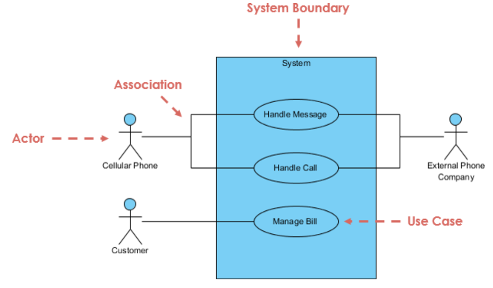
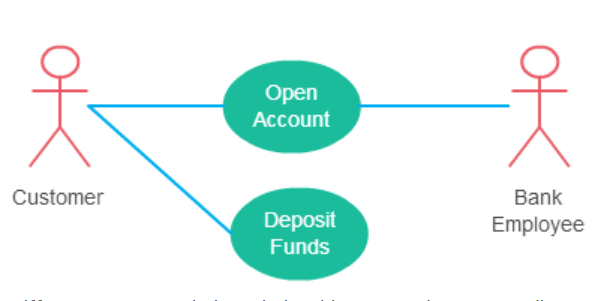
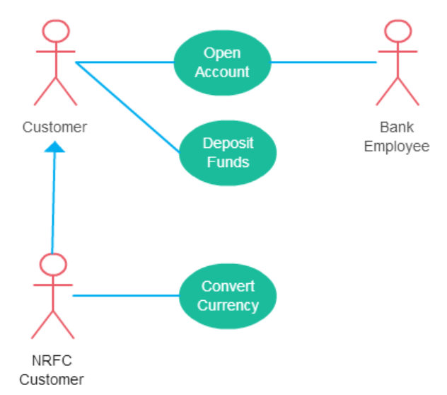
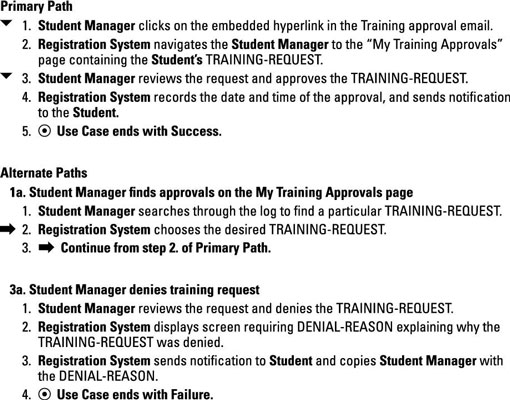
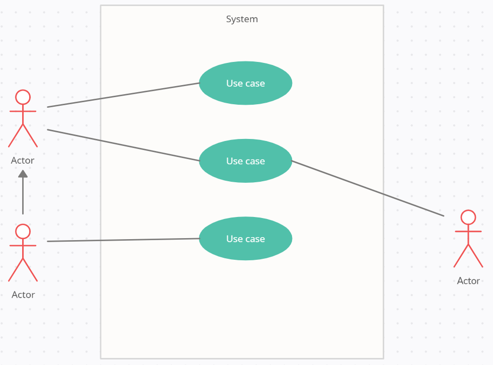

# Level 4 Use Case Guidelines <!-- omit in toc -->

## 1. Abstract

This document will serve to provide Level 4 students with knowledge and guidance of a key phase in modelling analysis. Use Case diagrams. At this level, you are not expected to create anything too advanced, but you will need to know the basics of how to create a simple use case diagram. In the software development lifecycle, you should be using your User Stories to form the basis of your Use Cases. Refer to the [User Stories guidance](level-4-user-stories.md) if you are yet to create a set of User Stories. Do not attempt to create a Use Case diagram without doing this first.

## 2. Table of Contents

- [1. Abstract](#1-abstract)
- [2. Table of Contents](#2-table-of-contents)
- [3. What Is A Use Case Model](#3-what-is-a-use-case-model)
- [4. Use Case Diagrams](#4-use-case-diagrams)
  - [4.1. What Does A Use Case Diagram Look Like](#41-what-does-a-use-case-diagram-look-like)
  - [4.2. Components Of A Use Case Diagram](#42-components-of-a-use-case-diagram)
  - [Actor](#actor)
  - [Use Case](#use-case)
  - [Communication Link](#communication-link)
  - [System Boundary](#system-boundary)
  - [4.3. Relationships](#43-relationships)
  - [Association](#association)
  - [Generalization Of An Actor](#generalization-of-an-actor)
- [5. Use Case Descriptions](#5-use-case-descriptions)
  - [5.1. Components Of A Use Case Description](#51-components-of-a-use-case-description)
  - [Title/Name](#titlename)
  - [Actors](#actors)
  - [Pre-Condition](#pre-condition)
  - [Post-Condition](#post-condition)
  - [Path](#path)
- [6. Tools](#6-tools)
  - [STARUML](#staruml)
  - [Draw.io](#drawio)
  - [Visio](#visio)
  - [Visual Paradigm](#visual-paradigm)
- [7. Template](#7-template)
- [8. References](#8-references)
  
## 3. What Is A Use Case Model

A Use Case Model is a modelling methodology used in system analysis to identify, clarify and organize system requirements. The Use Case is made up of a set of possible sequences of interactions between systems and users/actors in a particular environment and related to a particular goal. It is composed of two elements:

- Use Case Diagrams
- Use Case Descriptions

Use Cases describe the functional requirements of a system from the end user's perspective, creating a goal-focused sequence of events that is easy for users and developers to follow.

## 4. Use Case Diagrams

A Use Case diagram is often the primary form of system/software requirements analysis, A **Use Case** specifies what the expected behaviour of the system will be, it does not go into detail of the exact method that will make it happen. Use Cases, can be textual, or visual, the latter in the form of a Use Case diagram.

A key concept of Use Case modeling is that it helps developers design a system from the end user's perspective. It is an effective technique for communicating system behavior in the user's terms by specifying all externally visible system behavior.

A Use Case Diagram is often simple, as it does not show the detail of the Use Cases. It does however:

- Summarize some of the relationships between use cases, actors, and systems.
- Not show the order in which steps are performed to achieve the goals of each Use Case.
- Specify the context of a system
- Captures the requirements of a system
- Validates a systems architecture
- Drives implementation and generate test cases

### 4.1. What Does A Use Case Diagram Look Like

A simple Use Case Diagram can be seen here:

*Fig. 1: A simple Use Case Diagram. Retrieved from reference [1].*

This diagram shows the four main components of a Use Case diagram:

- Actor
- Use Case (Identified from User Stories)
- Communication Link
- System Boundary

### 4.2. Components Of A Use Case Diagram

We will now go into some detail about the different components of a Use Case diagram.

### Actor

- Someone that interacts with use case (system function).
- Named by noun.
- Actor plays a role in the business
- Similar to the concept of user, but a user can play different roles
- For example:
  - A prof. can be instructor and also researcher
  - plays 2 roles with two systems
- Actor triggers use case(s).
- Actor has a responsibility toward the system (inputs), and Actor has expectations from the system (outputs).

### Use Case

- System function (process - automated or manual)
- Named by verb + Noun (or Noun Phrase).
- Does something
- Each Actor must be linked to a use case, while some use cases may not be linked to actors.

### Communication Link

- The participation of an actor in a use case is shown by connecting an actor to a use case by a solid link.
- Actors may be connected to use cases by associations, indicating that the actor and the use case communicate with one another using messages.

### System Boundary

- The system boundary is potentially the entire system as defined in the requirements document.
- For large and complex systems, each module may be the system boundary.
- For example, for an ERP system for an organization, each of the modules such as personnel, payroll, accounting, etc can form a system boundary for use cases specific to each of these business functions.

These are based from reference [1].

### 4.3. Relationships

There can be 5 relationship types in a Use Case diagram.

- Association between actor and Use Case
- Generalization of an actor
- Generalization of a Use Case
- Extend between two Use Cases
- Include between two Use Cases

At this level, we only expect you to understand and apply Association and Generalization of an actor. So we will go into detail about these.

### Association

This one is straightforward and present in every use case diagram:

- An actor must be associated with at least one use case.
- An actor can be associated with multiple use cases.
- Multiple actors can be associated with a single use case.

An example of Association is shown here in this simple example:

*Fig. 2: A simple Use Case Diagram with association.*

### Generalization Of An Actor

Generalization of an actor means that one actor can inherit the role of the other actor.
The descendant inherits all the use cases of the ancestor. The descendant has one or more use cases that are specific to that role.
Expanding on the previous diagram, the following now includes generalization:

*Fig. 3: A Use Case Diagram with generalization of an actor.*

These are based from reference [2].

## 5. Use Case Descriptions

A use Case description is similar to that of a diagram, however where the diagram is a more visual element, a description is how it sounds. It is defined as a written account of the sequence of steps performed by an actor to accomplish some sort of task. It goes into more detail about how the system is expected to behave than a Use Case Diagram, and can therefore refine the details in the diagram.

An example of a Use Case Description can be seen here:

*Fig. 4: Simple Use Case Description. From reference [3].*

### 5.1. Components Of A Use Case Description

Most Use Case Descriptions include the following elements at a minimum. You should try to use the same components in your own descriptions for your projects (this is a seperate Use Case Model than Fig. 4):

*Fig. 5: Conditions of a Use Case Description. From reference [4].*

### Title/Name

The title communicates the goal of the Use Case. In the example, Login.

### Actors

The people who interact with the Use Case. This can be broken down into Primary (the actor who starts the use case), Secondary (the one who interacts with the use case) and even Off-Stage (those who don’t interact directly with the use case but are involved from a business rule perspective) if needed.

### Pre-Condition

Preconditions are those things that need to be in place before the use case can start. In the example, the system must be connected to the network so a user can login.

### Post-Condition

Postconditions are in place when you finish the use case successfully or unsuccessfully. A postcondition on success indicates what happens when the process completes successfully. A postcondition on failure is the opposite.

### Path

Also called flow or story, the path is the step-by-step action and interaction between the actor and the system (like that of Fig. 4). Paths come in three types:

- Primary path/Main Flow:  The most commonly taken path to a successful conclusion.
- Alternate path: This path is an alternate, less-frequented way to get to a successful conclusion.
- Exception path: This path is an alternate path that leads to an unsuccessful conclusion.

## 6. Tools

There are a variety of software tools that you can use to create Use Case diagrams, some of which we recommend are:

### STARUML

- Download/link: <https://staruml.io/>
- How to use: <https://docs.staruml.io/working-with-uml-diagrams/use-case-diagram>

### Draw.io

- Download/link: <https://app.diagrams.net/>
- How to use: <https://drawio-app.com/uml-use-case-diagrams-with-draw-io/>

### Visio

- Free on university machines
- How to use: <https://support.microsoft.com/en-us/office/create-a-uml-use-case-diagram-92cc948d-fc74-466c-9457-e82d62ee1298#:~:text=You%20can%20create%20a%20UML,such%20as%20a%20software%20application.&text=An%20association%20illustrates%20the%20participation,system%20to%20complete%20a%20process>.

### Visual Paradigm

- Download/link: <https://www.visual-paradigm.com/>
- How to use: <https://www.visual-paradigm.com/support/documents/vpuserguide/94/2575/6362_drawinguseca.html>

## 7. Template

I will now show you a simple template that you can start with, this is the start of a very simple Use Case diagram, you should add in as many Use Cases and actors as you can think of when are identifying your User Stories:

*Fig. 6: A simple Use Case Diagram template.*

I have also provided you with a template that you can use to create your Use Case Descriptions. This can be found [here](use_case_description_template.docx).

At this stage, you should have already created a set of **User Stories**. Use these stories to identify the Use Cases and Actors in your **Use Case Diagrams** and **Use Case Descriptions**. After this point, you can then use the **Use Case Models** to help you create sequence diagrams (more on this in modelling-design).

## 8. References

[1] Visual Paradigm. What is Use Case Diagram? <https://www.visual-paradigm.com/guide/uml-unified-modeling-language/what-is-use-case-diagram/>.

[2] Creately. Use Case Diagram Relationships Explained with Examples. <https://creately.com/blog/diagrams/use-case-diagram-relationships/>.

[3] Dummies. How to Create Use Case Description for Your Business Analysis Report. By Kupe Kupersmith, Paul Mulvey, Kate McGoey. <https://www.dummies.com/business/business-strategy/how-to-create-use-case-description-for-your-business-analysis-report/>.

[4] Warren Lynch. Use Case Description Example. <https://warren2lynch.medium.com/use-case-description-example-4b04280d6435>.
