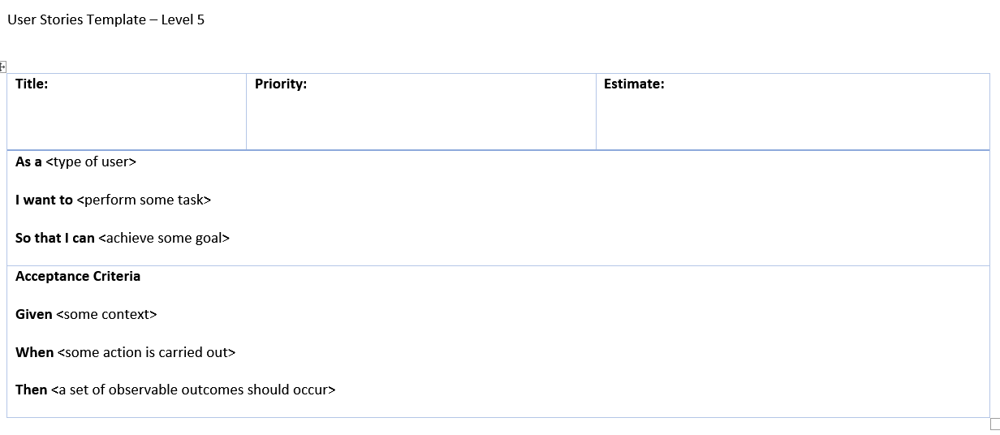

# Modelling - Analysis - Level 5

## 1. Table of Contents
- [2. User Stories](#2-user-stories)
- [3. Acceptance Criteria](#3-acceptance-criteria)
>  - [3.1. ](#31-)

- [4. References](#4-references)

## 2. User Stories

A User Story is an informal, natural language description of one or more features of a software system. We write these under the perspective of a potential end user of our system.  
At Level 5, the expectation of your User Stories will be to fulfil the basic criteria using the template of;

* As a
* I want to
* So that I can

Which enable us to identify "the actor", "the narrative" and "the goal".  
They are a useful tool to help us organise our understanding of the system and it's context.  
At Level 5, basic indications of **Acceptance Criteria** are required as well.

### 3. Acceptance Criteria

Aceeptance Criteria is defined as 'what the story needs to do before it can be considered satisfactory'.
These follow the typical agile format of;

* Given
* When
* Then

Defining the required amount of detail to be included here varies based on your team, your project and program.  
Sometimes you may be expected to include what is known as **Predecessor Criteria**.  
You can also write your acceptance criteria in the form of bullet points, but communicate with your team and find out the way you want to structure them in advance.

## 4. References
[RubyGarage - Clear Acceptance Criteria and Why it's Important](https://rubygarage.org/blog/clear-acceptance-criteria-and-why-its-important)
