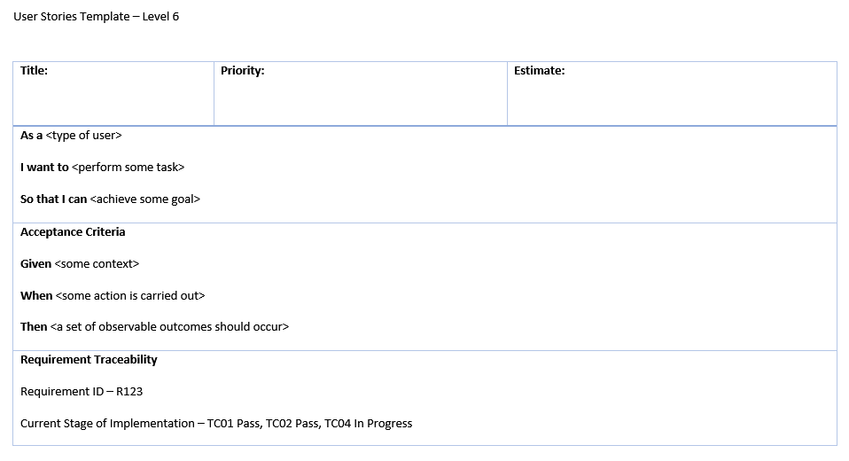

# Modelling - Analysis - Level 6

## 1. Table of Contents
- [2. User Stories](#2-user-stories)
  - [2.1. Acceptance Criteria](#21-acceptance-criteria)
      - [2.1.1 What are Acceptance Criteria used for?](#211-what-are-acceptance-criteria-used-for)
      - [2.1.2. Who Writes Acceptance Criteria and When?](#212-who-writes-acceptance-criteria-and-when)
      - [2.1.3. How to Write Acceptance Criteria](#213-how-to-write-acceptance-criteria)
  - [2.2. Requirement Traceability Matrix](#22-requirement-traceability-matrix)
  - [2.3. Use Case Diagrams](#23-use-case-diagrams)
      - [2.3.1. Requirement Specification](#231-requirement-specification)
      - [2.3.2. Persona and User Scenario](#232-persona-and-user-scenario) 
- [3. References](#3-references)

## 2. User Stories

A User Story is an informal, natural language description of one or more features of a software system. We write these under the perspective of a potential end user of our system.  
At Level 6, the expectation is that your User Stories are well defined and also fulfil the criteria using the template of;

* As a
* I want to
* So that I can

Which enable us to identify "the actor", "the narrative" and "the goal".  
They are a useful tool to help us organise our understanding of the system and it's context.  
At Level 6, Acceptance Criteria is required.

### 2.1. Acceptance Criteria

In the perfect world, people would understand each other at a glance and nothing could create confusion among them. But in the real world we have to come up with ways to communicate our ideas clearly so that our peers don’t misunderstand us.  
In software development, Acceptance Criteria help to properly set a client’s expectations for a product. Criteria for an app such as “I want my app to be awesome and popular with as many people as possible” don’t really tell us much; we eliminate misunderstandings between a client and a development team by referring to clearly defined Acceptance Criteria for user stories.  

When writing Acceptance Criteria, it is not only important for elciting the vision of a product from your client, but for the development process as well. It's natural that different people see the same problem from different angles. Clearly written criteria introduct a single solution to the functionality you intend to implement.  

#### 2.1.1. What are Acceptance Criteria used for?

* **To define boundaries:** Acceptance Criteria help development teams define the boundaries of a user story. In other words, acceptance criteria help you conform when the application functions as desired, meaning that a user story is completed.
* **To reach consensus:** Having acceptance criteria synchronizes the development team with the client. The team knows exactly what conditions should be met, just as the client knows what to expect from the app.
* **To serve as a basis for tests:** Last but not least, acceptance criteria are a cornerstone of positive and negative testing aimed at checking if a system works as expected.
* **To allow for accurate planning and estimation:** Acceptance criteria scenarios allow for the correct division of user stories into tasks so user stories are correctly estimated and planned. 

#### 2.1.2. Who Writes Acceptance Criteria and When?

Your client or development team will be the ones to write your acceptance criteria, but as a rule, any criteria written by a **product owner (the client)** should be reviewed by a member of the development team to make sure that the criteria are clearly specified and that there are no technical constraints or inconsistencies from the development perspective. Such flow is an excellent way to collaborate if the product owner has some experience in software development and is aware of how to write project dopcumentation.  

Remember that Acceptance Criteria should be specified **upfront** and **never** after the development stage has started. Therefore, a team and a product owner should agree on minimum deliverables that will meet the product owner's requirements.  

If you prefer to assign writing acceptance criteria to the development team, then a requirements analyst, project manager or QA specialist should deal with this task, since they know the technology stack and the feasibility of features.

#### 2.1.3. How to Write Acceptance Criteria

Acceptance Criteria is defined as 'what the story needs to do before it can be considered satisfactory'.
The common template for describing acceptance criteria using a scenario-oriented approach is the

* Given
* When
* Then  

format that is derived from **behaviour driven development**. This format is used for writing acceptance criteria tests that ensure that all the specification requirements are met. This format is convenient for humans (since it’s written in a familiar cause-and-effect manner) as well as for automated testing tools like Cucumber and RSpec. For example, when we build a website that has two types of users ‒ logged-in users and guests ‒ we’re likely to write the following acceptance criteria for a user story that defines the sign-in feature for a logged-out user:  

> **As** a logged-out user  
> **I want** to be able to sign in to a website  
> **So that** I can find access my personal profile  
  
> **Scenario:** System user signs in with valid credentials  
> “Given I’m a logged-out system user  
> and I’m on the Sign-In page  
> When I fill in the “Username” and “Password” fields with my authentication credentials  
> and I click the Sign-In button  
> Then the system signs me in”  

This template helps you to reduce the time spent on writing test cases since you describe the systems' behaviour upfront. We prefer writing acceptance criteria with the first-person “I” since it helps us talk from a user’s perspective and keep a user’s needs in mind.  

Defining the required amount of detail to be included here varies based on your team, your project and program.  
Sometimes you may be expected to include what is known as **Predecessor Criteria**.  
You can also write your Acceptance Criteria in the form of bullet points, but communicate with your team and find out the way you want to structure them in advance.  

Here are a few tips that’ll help you write great acceptance criteria:

* Keep your criteria well-defined so any member of the project team understands the idea you’re trying to convey.
* Keep the criteria realistic and achievable. Define the minimum piece of functionality you’re able to deliver and stick to it. On the other hand, don’t try to describe every detail since you risk cluttering up your backlog and getting buried under many small tasks.
* Coordinate with all the stakeholders so your acceptance criteria are based on consensus.
* Create measurable criteria that allow you to adequately estimate development time so you’re able to stay within budget and time constraints.
* Consider providing checklists that enable you to see what user stories are covered with acceptance criteria.  
  
  
*Figure - RubyGarage Acceptance Criteria: Unclear vs Clear*

## 2.2. Requirement Traceability Matrix
This is a document that is used to demonstrate relationships between requirements and other artefacts.  
It is the ability to connect your requirements to other artefacts, such as different types of software tests or bugs. It's used to track requirements, and prove that requirements have been fulfilled.

## 2.3. Use Case Diagrams

### 2.3.1. Requirement Specification

### 2.3.2 Persona and User Scenario

## 3. References
[RubyGarage - Clear Acceptance Criteria and Why it's Important](https://rubygarage.org/blog/clear-acceptance-criteria-and-why-its-important)
