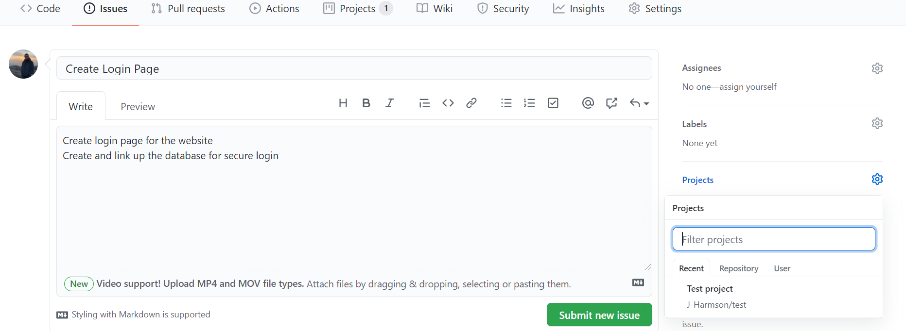

# Project Management Tools

## 1. Abstract

This document will serve to provide students with examples on how to use the recommended project management tools outlined in the level specific guidelines:
[Level 4](/planning/project-management/level-4/level_4_management_guidelines.md)
[Level 5](/planning/project-management/level-5/level_5_management_guidelines.md)
[Level 6](/planning/project-management/level-6/level_6_management_guidelines.md)

We will go through some basic examples of how to set up the tools to do effective and efficient project management, that you can apply to your own projects.

## 2. Table of Contents

- [1. Abstract](#1-abstract)
- [2. Table of Contents](#2-table-of-contents)
- [3. Trello](#3-trello)
  - [3.1. Setting Up The Board](#31-setting-up-the-board)
  - [3.2. Adding Members](#32-adding-mambers)
  - [3.3. Making Changes](#33-making-changes)
  - [3.4. Adding Tasks](#34-adding-tasks)
  - [3.5. Management Process](#35-management-process)
- [4. Github Projects](#4-github-projects)
  - [4.1. Setting Up The Board](#41-setting-up-the-board)
  - [4.2. Adding Tasks](#42-adding-tasks)
## 3. Trello

Trello is a free, and very versatile project management tool, and is the tool that I would recommend to students of all levels.
It is a Kanban board (Agile development) allowing users to track the status of their projects. The concepts behind Agile development are highlighted in [Level 5 guidelines](/planning/project-management/level-5/level_5_management_guidelines.md), along with details on how to properly manage your projects.

## 3.1. Setting Up The Board
I will now walkthrough an example of how to set up Trello for project management, you should follow a similar structure to the example in your own projects:

1. Go to https://trello.com/en and create an account
2. If you navigate to **Boards**, you should see a screen similar to this (my Trello has a few boards already set up):

*Fig. 1: Trello Starting Page.*

3. Click **Create a new board** or click the **+** button in the top right corner of the screen and then **Create board**
4. Fill in the fields with appropriate information and click **Create Board**. You should see something similar to this:

*Fig. 2: Trello starting board.*

5. We will now set up our lists. Click **Add a list** and set the title to **To Do** then press Enter or click **Add list**
6. Repeat step 5 but set the titles of the lists to **Doing**, **Needs Review** and **Done** along with any other lists you deem appropriate. You should now have something that looks like this:

*Fig. 3: Trello board with lists added.*

## 3.2. Adding Members:

Follow these steps to add your team members to the board so that they can see and make changes:

1. In the centre at the top of the screen you should see **Invite**, click this.
2. You now have 2 options, you can manually search for your team members' email addresses/names and add them in, or you can click **Create Link** to send them a link to the board
3. If you search for members' names, they should recieve an email inviting them to the board. Their icons should appear next to your own next to the **Invite** button.
4. You may wish to change the privacy of the board, to allow only members of the team to view it. To do this, simply click the change visibility button to the left of your icon. You can also change teams by clicking the button to the left of that.

## 3.3. Making Changes

You can make changes to the visual appearance of the board and view the boards' activity by clicking the **Show Menu** button to the right of the screen. 
Feel free to navigate this menu in your own time.

## 3.4. Adding Tasks

The process of adding tasks is similar to that of creating a list:

1. Navigate to the **To Do** list and click **Add a card**
2. Fill in the field with the task you wish to add
3. Click the **ellipsis** to the right of the card to add members and labels (you can also do this later)
4. Once the card has been added, you can click on it to apply more features, such as labels, add members, create a checklist and add a due date. We recommend you do all of these to make for clear, structured project management. Remembering to update the checklist and keep an eye on the due date
5. Repeat this for all tasks that you have identified from your User Stories/Requirements Specification. After you have done this, you should have something similar to this:

*Fig. 4: Trello board with tasks added.*

## 3.5. Management Process

Once your board is set up, you are ready to start on your project! (if at development stage). You must now manage your project using Trello. This is explained in greater detail in the level specific guidelines.
You can move your cards (tasks) to the different lists depending on their status. If they are being worked on, move to **Doing**, if they need to be reviewed, **Needs Review** etc. Remembering to update the checklist as you are working on them.

If you have been doing this correctly throughout development, your board should look something like this:

*Fig. 5: Trello board with progress made.*

Keep working and updating your board with your progress, until eventually, all tasks are under the **Done** list, with their checklists complete and due dates marked complete.

## 4. Github Projects

Not only can Github be used for version control, it can also be used effectively as a project management tool. You can do this through Github Projects within your repository (which you should set up for every project). It works in a similar way to Trello, in the sense that it is a Kanban board, however, as this board is integrated with Github, it can be used in conjunction with issues and milestones which are explained in detail in the version control guidelines, therefore I will not be explaining them here.

I will now walkthrough how to set up Github Projects for your own projects in your repositories. It is similar to the setup for Trello.

## 4.1. Setting Up The Board

1. Navigate to your repository and click **Projects** on the navigation bar at the top
2. On the right, you should see a green button that says **Create a project**, clisk it and fill in the fields
3. At the bottom, you should see a **Template** option, this will save you time by creating the lists for you. We recommend you select:
* **Basic kanban** for Level 4
* **Automated kanban with reviews** for Levels 5 and 6
4. Click **Create project** when you are satisfied. You should see something similar to this, you can add cards such as **Done** if you wish:

*Fig. 6: Example Github Projects board.*

## 4.2. Adding Tasks

Adding tasks/cards to Github Projects is a little different to Trello. Tasks are added in the form of **Issues**. I will not go over how to create an issue here as I have included this in the [Level 5 version control guidelines](/planning/version-control/level_5_git_instructions.md). In short, navigate to **Issues** in your repository, and create an issue.

When you create an issue, you can assign it to a project. If you already have a project created like in this example, it should appear in the issue as seen here:

*Fig. 7: Example Github Issue creation to link with Project.*

Once the issue has been created, you should see that it has been added to the project under the **To Do** list via automation. This issue is now a card in the project, if you navigate back to your project, you can click the issue to see information, and click **Go to issue for full details** if you need to navigate back to the issue page. If you have done all of this correctly, you should see something like this:

*Fig. 8: Example Github Projects board with a task added.*

Repeat this with all of your issues, and new issues when they are created. In a similar way to Trello, you should drag and move your cards/issues between the lists in your project to track their status. Your board should look something similar to the board in [3.5. Management Process](#35-management-process).

## 5. Other Software Available

If you want to use software other than those shown above, there are other software available such as:

### MS Project (paid service but can be used for free on university machines)
### MS Excel
### Basecamp (free for students)
### Wrike

