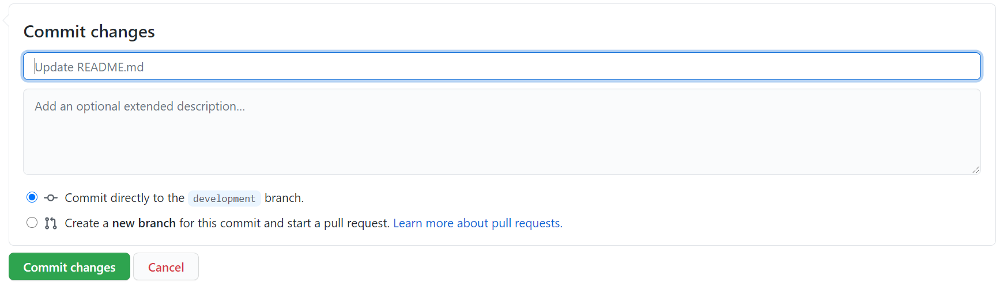
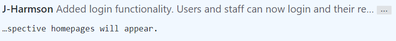
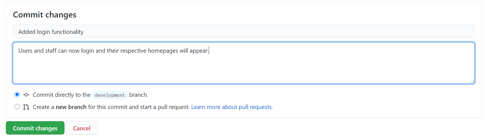

# Git Commit Guidance <!-- omit in toc -->

## 1. Abstract

This document will outline how you should be structuring your Git commit messages when pushing changes to your repositories. It is important that you do not simply leave the default message as this does not let your team know what changes you have made.

You can see how to integrate Git with the tools you will likely be using; Visual Studio 2019, IntelliJ IDEA and Eclipse in the tools guidelines [here](/planning/version-control/tools/level_4_git_tools.md).

## 2. Table of Contents

- [1. Abstract](#1-abstract)
- [2. Table of Contents](#2-table-of-contents)
- [3. Structure](#3-structure)
- [4. Committing the Changes](#4-committing-the-changes)
- [5. Committing from the Terminal](#5-committing-from-the-terminal)
- [6. References](#6-references)

## 3. Structure

Git commit messages are structured like the following:

The top field is where the main commit summary should go. As seen in the image above, it will defaul to 'Update...'. You should change this as this is just a vague description of what you have done.
You will need to put more than this. You should describe briefly what changes you have made, such as 'Added login functionality' or 'Added comments to code'. 

In this field, there is a 50 character limit. You can go over this limit, but it is not advised, as a good commit summary should be concise, and within the 50 character limit.
If you go over this limit, Github will truncate the summary at the 50th character, then add the rest in the description box below it:

As well as the summary, if you feel more detail is needed to explain the changes you have made, you can write them in the description box. This field does not have a character limit, so you can write as much as you need (but try to keep it as concise as possible).
If you follow this, your Git commit summary should look something like this:

## 4. Committing the Changes

Just before you commit the changes you have made, always make sure to check what branch you are pushing to. You do not want to commit your changes directly to **master** if you are all working off of the **develop** branch, so just make sure you are committing to the branch you are wanting to.

You can also make a new branch when you commit the changes, as seen at the bottom of the previous image. This can be used if you have spent a lot of time making the changes, but are working on the wrong branch. Remember, if you are doing this, call the branch 'feature - ...' with the ellipsis being exchanged for whatever you are working on.
A pull request can also be made if you are committing this way.

## 5. Committing from the Terminal

If you are using Git within a terminal, you should still follow the guidance above, however the UI will obviously not be there. Therefore, you should follow these 7 steps to produce a great commit message:

1) Separate subject from body with a blank line
2) Limit the subject line to 50 characters
3) Capitalize the subject line
4) Do not end the subject line with a period
5) Use the imperative mood in the subject line
6) Wrap the body at 72 characters
7) Use the body to explain what and why vs. how

This and more guidance can be seen in reference [1].

## 6. References

[1] Chris Beams. How to Write a Git Commit Message. <https://chris.beams.io/posts/git-commit/>.
