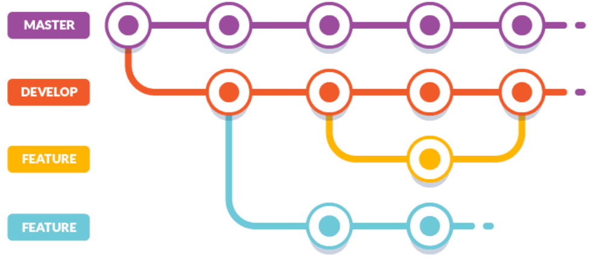

# Git Instructions for Level 5 Students <!-- omit in toc -->

## 1. Abstract

This document will serve as a follow up to the document ‘Git Instructions for Level 4 Students’. This document is aimed at Level 5 students, and as a refresher for Level 6 students and therefore will include some more advanced features of Git/Github, not explained in the Level 4 document.

If you need a refresher on the basics of Git, head over to [level-4-git-instructions.md](level-4-git-instructions.md) in the planning/version control folder.

## 2. Table of Contents

- [1. Abstract](#1-abstract)
- [2. Table of Contents](#2-table-of-contents)
- [3. Using Git Collaboratively](#3-using-git-collaboratively)
- [4. Branching](#4-branching)
  - [4.1. Creating a Branch](#41-creating-a-branch)
- [5. Pull Requests](#5-pull-requests)
  - [5.1. Opening a Pull Request](#51-opening-a-pull-request)
- [6. Merging](#6-merging)
- [7. Workflow](#7-workflow)
- [8. Hints on DevOps Automation](#8-hints-on-devops-automation)
- [9. References](#9-references)

## 3. Using Git Collaboratively

Git/Github is great for collaborative work, teams of developers can access a team repository and everything in it. Often in software development, you will work in a team with other developers. Creating a team repository that all members can access, and use is vitally important for collaborative work. It will ensure that all code is up to date and you can track the progress of tasks. You can all be working on different tasks and then push the changes to Github when you have finished a task, updating the project, ensuring the most up to date version is on the main branch.

## 4. Branching

Branching is a very important concept in version control, it allows you to work on different versions of the repository at a time, and allows the leader of the project to review changes a developer has made before committing them to the main branch. This is important as the changes may not be correct or may have unintentionally removed another developers’ code. Creating a branch will ensure the main branch, where the most up to date code will be stored, will not be changed without review from the project lead.

### 4.1. Creating a Branch

The following instructions will walkthrough how to create a branch on your repository:

1. Go to your repository;
2. Click the drop down at the top of the file list that says **master**;
3. Type a branch name (readme-edits for example), into the new branch text box;
4. Select the blue **Create branch** box or hit “Enter” on your keyboard.

If you have followed this correctly, a new branch should be created. You can now make changes to this branch without changing the main branch (commit a change to the readme now so that we can walkthrough pull requests)

## 5. Pull Requests

Pull requests are vitally important for collaborative work and go hand in hand with branching. When you open one, you are proposing the changes you have made on a branch and requesting that someone review and pull your changes, merging them with the main branch. The pull request will show differences to whatever is in the main branch, with additions shown in green and subtractions shown in red.

### 5.1. Opening a Pull Request

I will now walkthrough how to open a pull request. As the repository in this example is individual work, I will be the one to review the changes, in a team, this will be done by the project lead or another developer:

1. Go to your repository;
2. Click the **Pull Request** tab and then click the green **New pull request** button;
3. Select the branch you made edits on, in this case, readme-edits, to compare with the main branch;
4. Look over the changes, make sure they are what you want to submit;
5. Click **Create Pull Request** when you are satisfied;
6. Give the request a title and brief description and click **Create pull request!**.

## 6. Merging

I will now walkthrough how to merge the pull request you made, as previously mentioned, this would usually be done by the project lead or another developer. This will merge your changes in readme-edits with the main branch:

1. Go to your repository;
2. Click the **Pull Request** tab, you should see the pull request you submitted earlier, click it;
3. Look over the changes by clicking the **Commits** tab and selecting the request;
4. Once you are satisfied, click the green **Merge pull request** button;
5. Click **Confirm merge**;
6. If you wish, you can delete the branch you made the changes to by clicking the **Delete branch** button.

If you have done all of this correctly, your changed readme should appear in the master branch. Sections 4-6 are based off of reference [1].

## 7. Workflow

As with Level 4, it is also important to employ a good workflow at Level 5. At this Level, we expect you to have more experience with Git, and therefore can build on the workflow from L4, to make it more appropriate for use with teams of developers. The following image shows an example you can follow at Level 5, known as Gitflow. Again, you are free to adapt this workflow to your needs as you see fit:

*Fig. 1: Structure for gitflow.*
Image from [Buddy Works](https://buddy.works/blog/5-types-of-git-workflows).

This structure is based on reference [2].

The structure in Fig. 1 shows a type of workflow known as Gitflow. It is a more advanced version of the basic flow we saw at Level 4, which features two, long-running parallel branches, **main/master** and **development**. Again, master is always ready to run with the latest version of the code (which should be tagged), which has been tested thoroughly.

Everyone should work on the development branch, with feature branches being added and worked on by each developer. Merge requests should be made when you are wanting to merge with the development branch. On this branch, thorough testing and code reviews of the implimented features should be done before merging with the main branch. If the new features pass all tests, it can be merged with the main branch, with the release version being updated.

If you follow this guidance, you will have a clear structure to your repository. There should be no mistakes on the main branch due to the testing and code reviews occurring on the development branch, and if all developers clone the development branch and push code onto feature branches, everyone can work independently, then open merge requests for review to merge with development.

## 8. Hints on DevOps Automation

DevOps is a set of practices that combines software development with IT operations. Its main aim is to shorten the development cycle and provide continuous integration and delivery (CI/CD). It is complimentary with Agile software development, which you will become familiar with at Level 5.
Automation is one of the key principles for accelerating development with DevOps, it is the addition of technology that performs tasks with reduced human assistance. You will become more familiar with DevOps and automation at Level 6, but it is useful to have knowledge of the basics at Level 5. Here are a few hints and helpful guidelines for basic DevOps automation:

- Choose open standards (maintain tooling that follows common, open standards)
- Use dynamic variables (prioritise reusable code, using externally defined variables to allow automation on different environments without needing to change the code)
- Use flexible tooling (using a DevOps tool that allows you to change technologies and reduce rework if a change of direction is needed)
- Use version control where possible
- Apply continuous monitoring (logging, monitoring, alerting, tracing)

These tips are based from reference [3].

## 9. References

[1] Hello World. Getting started with github. <https://guides.github.com/activities/hello-world/>.

[2] Gitflow. 5 types of Git workflows that will help you deliver a better code. <https://buddy.works/blog/5-types-of-git-workflows>.

[3] Github Blog. Getting started with DevOps automation. <https://github.blog/2020-10-29-getting-started-with-devops-automation/>.
