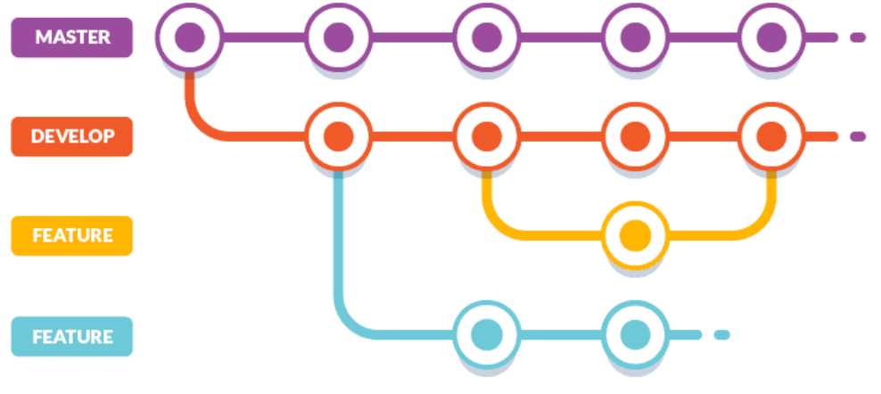

# Git Instructions for Level 6 Students <!-- omit in toc -->

## 1. Abstract

This document will serve as a follow up to both 'Git Instructions for Level 4 Students' and 'Git Instructions for Level 5 Students' and will be the final document in the series. This document is aimed at Level 6 students, and including both other documents, provides a full set of Git instructions that you will need throughout your time at University and beyond.

Included here are advanced features and strategies that you should be using during the software development lifecycle.
If you need a refresher on the basics or other advanced features of Git, head over to [level-4-git-instructions.md](level-4-git-instructions.md) and [level-5-git-instructions.md](level-5-git-instructions.md) which are both available in the planning/version control folder.

## 2. Table of Contents

- [1. Abstract](#1-abstract)
- [2. Table of Contents](#2-table-of-contents)
- [3. Issues](#3-issues)
- [4. Projects](#4-projects)
- [5. Milestones](#5-milestones)
- [6. Workflow](#6-workflow)
- [7. Merging Strategy](#7-merging-strategy)
- [8. DevOps Automation](#8-devops-automation)
- [9. References](#9-references)

## 3. Issues

Issues are great for collaborative work. They are essentially tasks which need to be completed for the project, you can assign yourself or developers to Issues which sends a notification to them letting them know they have been assigned a task. You can also comment on issues with your progress on them.

Issues help to keep track of what needs doing in your projects, they can be used in conjunction with 'Projects' (more on this later) to create a Kanban style, Agile methodology.
Follow the following instructions to create an Issue in your repository, assign yourself to it, and add labels:

1. Go to your repository;
2. On the navigation bar, click **Issues**;
3. Click **New Issue**;
4. Fill out the fields, including the title (what the task is) and a short description in the comment section;
5. Once you are satisfied, click **Submit new issue**;
6. You should now see the Issue, scroll down to **Assignees** and assign yourself or someone else to the issue;
7. Click on **Labels** and then select one from the list or create your own using **Edit labels**;
8. If you want to create your own label, click **New label**. Fill out the fields and click **Create label**;
9. Go back to your Issue and then **Labels** and select the label you just created;
10. You can also assign this Issue to a Project by clicking **Projects** if you have already created one.

## 4. Projects

Projects are often used in conjunction with Issues. It allows developers to sort issues and pull requests into a Kanban board, similar to software such as Trello. You can then plan and oversee your project, with issues and pull requests all being displayed for you to track your project.
Follow these instructions to create a project and add the issue you just created to it:

1. Go to your repository
2. Click **Projects** then **Create a project**
3. Fill in the fields, selecting a suitable title and description
4. If you wish, select a Template, **Automated kanban with reviews** is great if you want to include some DevOps Automation
5. Click **Create project** when you are satisfied. You should now see your project. You may have to click **Fullscreen** to see all cards
6. Navigate back to the issue you created before
7. Under **Projects** you should now see the project you created, click your project to add the issue to it. It will automatically be added to the 'To do' card
8. Navigate back to your project to check if the issue has been added, you may add new columns if you wish

## 5. Milestones

Milestones are used in conjunction with issues and pull requests. When you create a milestone, you can associate it with issues and pull requests to track the progress of your project. From the milestone page, you can see:

- A user-provided description of the milestone, which can include a project overview, relevant teams, and projected due dates
- The milestone's due date
- The milestone's completion percentage
- The number and a list of open and closed issues and pull requests associated with the milestone

Follow these instructions to create a milestone:

1. Go to your repository and select **Issues**;
2. Click **Milestones** then **New milestone**;
3. Fill in the fields and select a due date;
4. Click **Create milestone** once you are satisfied;
5. Navigate back to the issue you created previously, click it;
6. Like before with labels and projects, click on **Milestone**;
7. You should see your milestone, assign the issue to it.

If you have followed all steps to this point, you should now have an issue assigned to a Label, Project and Milestone. You can assign multiple issues to a Label, Project or Milestone. You should do this everytime you create an issue to greatly improve the organisation and tracking of your project.

## 6. Workflow

At Level 6, you should now have some experience with Basic Flow and Gitflow. You are likely to be working on larger projects at L6. so a full Gitflow workflow should be used, with main, development and feature branching being used. The structure of your repository should look something like this:

*Fig. 1: Structure for gitflow.*
Image from [Buddy Works](https://buddy.works/blog/5-types-of-git-workflows).

This structure is based on reference [1].

Developers should work off the development branch, pushing code changes onto feature branches, and then opening a merge request for code review (more on this strategy later). Once the code has been reviewed and merged with development, you should then test the code thoroughly before merging with the main branch. A full merging strategy should also be employed at this stage, the guidelines for this will be explained in the next section.

## 7. Merging Strategy

It is important to employ a concrete merging strategy for your development lifecycle to go along with your workflow. This will result in fewer merging mistakes such as code being removed when it shouldn't have been, code conflicts on both branches or code being merged when it shouldn't have been.  

To start with, a project lead or dedicated code reviewer should be chosen from your team. This developer will be responsible for reviewing the merge requests made by other developers on the feature and development branches. They will need to make sure no code is removed that shouldn't be and any code added is appropriate and fully functional. They should first look at the code on the feature branches, check that they are ok with no errors or conflicts, then merge the changes with the development branch.

When you are wanting to push a new release version, the code reviewer will then need to test and review the development branch thoroughly. As the main branch is always live and ready to run, any changes to it should be made with caution, after a thorough code review and testing. When the reviewer/project lead is happy, the development branch may be merged with main, making sure to add a tag to show the new release version.

If you employ this strategy, less merging mistakes will be made, your repository will have a clear and clean structure and history, and the main branch will always be live and be able to be shown to stakeholders if needed. This strategy is similar to that employed by many software development companies and is an industry standard. Showing an interviewer a project with a clear workflow and merging strategy will be sure to impress. This merging strategy is similar to 'Explicit Merging' which can be seen in reference [2].

## 8. DevOps Automation

TBD

## 9. References

[1] Gitflow. 5 types of Git workflows that will help you deliver a better code. <https://buddy.works/blog/5-types-of-git-workflows>.

[2] Atlassian. Git Merge Strategy Options and Examples. <https://www.atlassian.com/git/tutorials/using-branches/merge-strategy>.
