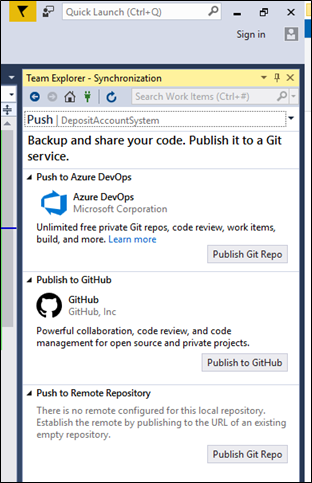
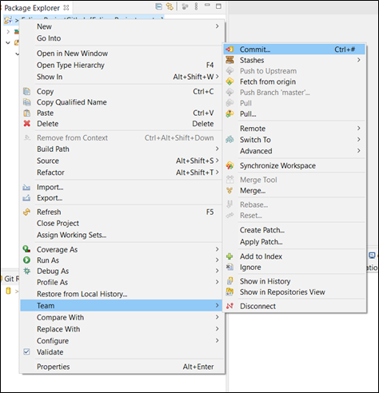

# Level 4 Git Tools <!-- omit in toc -->

## 1. Abstract

This document will walk through some examples of how to integrate Git into your development environment. At Level 4, you will be using Visual Studio 2019, IntelliJ IDEA and Eclipse for your projects. Therefore the following examples will be specific for these three IDE's.
Integrating Git into your IDE's is much more convenient than going directly through Github everytime you want to push or pull any changes from your repository.

## 2. Table of Contents

- [1. Abstract](#1-abstract)
- [2. Table of Contents](#2-table-of-contents)
- [3. Visual Studio 2019](#3-visual-studio-2019)
  - [3.1. How To Clone A Project](#31-how-to-clone-a-project)
  - [3.2. How To Push Your Project To Github](#32-how-to-push-your-project-to-github)
- [4. IntelliJ IDEA](#4-intellij-idea)
  - [4.1. Enabling Version Control](#41-enabling-version-control)
  - [4.2. Clone From An Existing Repository](#42-clone-from-an-existing-repository)
  - [4.3. Put An Existing Project Under Git](#43-put-an-existing-project-under-git)
  - [4.4. Adding files to Git](#44-adding-files-to-git)
  - [4.5. Committing Changes](#45-committing-changes)
- [5. Eclipse](#5-eclipse)
  - [5.1. Push A Project To Github](#51-push-a-project-to-github)
  - [5.2. Committing Changes](#52-committing-changes)
  - [5.3. Clone A Github Repository](#53-clone-a-github-repository)
- [6. Other Tools](#6-other-tools)
  - [VS Code](#vs-code)
  - [Github Desktop](#github-desktop)
  - [Git Kraken](#git-kraken)
- [7. References](#7-references)

## 3. Visual Studio 2019

As you will be predominantly coding in C# at Level 4, Visual Studio 2019 will be the best IDE to use for creating and editing your code. It will be of great benefit to you to integrate Git with this IDE, and it is very easy to do so.
I will now walk through how to integrate Git within Visual Studio 2019.

### 3.1. How To Clone A Project

1. Get the Github URL of the project that you wish to clone. From Github you can click the green **Code** button:

2. Open Visual Studio 2019. Select **Clone a repository**:

3. Paste the URL in **Repository Location**
4. Locate the path of the project to be saved on your computer
5. Click the **Clone** button:

### 3.2. How To Push Your Project To Github

1. From Visual Studio 2019, go to the right bottom of the screen. You can see **Add to Source Control**. Select Git:

1. This panel will be prompted. If there is no Team Explorer panel, go to **View** -> **Team Explorer**. Then select **Publish to Github**:

3. You might get a login window for Github if using Github on visual studio for the first time (or Github not connected), login if so.

4. If there are changes made to the project, you need to update your project repository.  Select **Changes**:

5. Input the message/hint of the changes and hit **Commit All** button, a dialog box will be prompted, select **Yes**.

6. Now, you need to push the changes to Github. Select **master** from the right bottom of the screen, then **Push**:

7. Login to you Github account, and check whether the changes have been updated to your repository.

## 4. IntelliJ IDEA

IntelliJ IDEA is the IDE we recommend for use with Java development, this IDE can also be integrated with Git. I will now walk you through how to set up Git with IntelliJ for use with your Java projects.

### 4.1. Enabling Version Control

In IntelliJ, you have to first enable version control. With a project open:

1. Choose **Enable Version Control Integration** from the **VCS Operations Popup**, or from the main **VCS** menu on the navbar at the top of your project.

2. In the **Enable Version Control Integration** dialog that opens, select a version control system from the list that you want to associate with your project root (Git).

3. After VCS integration is enabled, IntelliJ IDEA will ask you whether you want to share project settings files via VCS. You can choose **Always Add** to synchronize project settings with other repository users who work with IntelliJ IDEA.

### 4.2. Clone From An Existing Repository

1. From the main menu, select **Git | Clone**, or, if no project is currently opened, click **Get from VCS** on the Welcome screen.

2. In the **Get from Version Control** dialog, specify the URL of the remote repository you want to clone, or select one of the VCS hosting services on the left.
If you are already logged in to the selected hosting service, completion will suggest the list of available repositories that you can clone:

*Fig.1: List of repositories. From reference [1]*

3. Click **Clone**. If you want to create a project based on the sources you have cloned, click **Yes** in the confirmation dialog. Git root mapping will be automatically set to the project root directory.
If your project contains submodules, they will also be cloned and automatically registered as project roots.

4. When you import or clone a project for the first time, IntelliJ IDEA analyzes it. If the IDE detects more than one configuration (for example, Eclipse and Gradle), it prompts you to select which configuration you want to use.
Select the necessary configuration and click **OK**:

*Fig.2: Check out a project from a remote host (clone). From reference [1]*

### 4.3. Put An Existing Project Under Git

1. Open the project that you want to put under Git.

2. Choose **Enable Version Control** Integration from the VCS Operations Popup (Alt+) or from the main VCS menu.

3. Choose **Git** as the version control system and click **OK**.

4. After VCS integration is enabled, IntelliJ IDEA will ask you whether you want to share project settings files via VCS. You can choose **Always Add** to synchronize project settings with other repository users who work with IntelliJ IDEA.

### 4.4. Adding files to Git

Most changes that you may need to make to your repository can be managed within IntelliJ, under the **Commit** tool window (Alt+0). I will only demonstrate how to add files and commit changes, but deletion, and comparison status checking can all be done under this window.

1. In the **Commit tool** window (Alt+0), expand the **Unversioned Files** node.

2. Select the files you want to add to Git or the entire changelist and press Ctrl+Alt+A or choose **Add to VCS** from the context menu.
You can also add files to your local Git repository from the Project tool window: select the files you want to add, and press Ctrl+Alt+A or choose **Git | Add** from the context menu.

### 4.5. Committing Changes

1. Open the vertical **Commit** tool window (Alt+0) located on the left:

*Fig.3: Commit changes locally. From reference [2]*

2. As your changes are ready to be committed, select the corresponding files or an entire changelist.
If you press Ctrl+K, the entire active changelist will be selected.
You can also select files under the **Unversioned Files** node — IntelliJ IDEA will stage and commit these files in one step.

3. Enter the commit message. You can click Commit message history button to choose from the list of recent commit messages.
You can also edit the commit message later before you've pushed the commit.

4. When you're ready, click **Commit** or **Commit and Push** (Ctrl+Alt+K) to push the changes to the remote repository immediately after the commit. You will be able to review the current commit as well as all other commits before they are pushed to the remote.

## 5. Eclipse

Along with IntelliJ IDEA, Eclipse is also a great option for Java development. Similarly to the previous IDE's, Eclipse can also be integrated with Github. I will now walkthrough an example of how to do this.

### 5.1. Push A Project To Github

1. Create a repository on Github:

2. Copy the URL:

3. Go into Eclipse, and find **Perspectve** from the top left:

Or search for **Git Repositories** in the search bar next to it.
A panel should be added to the work space:

4. Select this icon to clone the repository you created previously:

5. Paste the URL of the repository you copied earlier, then click **Next** then **Next** again. Then finally, click **Finish**. A new repository should be created:

6. Create a project in Eclipse. Then right click the project -> Team -> Share Project:

7. Select the Github repository you just created:

Then select **Finish**

### 5.2. Committing Changes

1. Right click the project again, then Team -> Commit:

A new panel should appear at the bottom:

2. Select all the files in **Unstaged** then drag to the **Stage Changes** area. You can also click the **+** icon.

3. Create a message then select **Commit and Push**. Then select **Preview**,

4. Input your Github details and select **Log in**. Then, select **Push** and enter your details once again.

5. The changes should now be pushed, go ahead and click **Close**. Check your Github, the project source code should have been pushed:

### 5.3. Clone A Github Repository

1. From file, select **Import**

2. This panel should be prompted, select Git -> Project from Git (with smart import):

3. Select **Clone URI**, then copy in the Github URL (the project you wish to clone) and paste it in **URI**, then select **Next**, then **Next** again.

4. Name the new folder if the suggest name (from Github) is already existed in your directory, and click **Next**.

5. Select **Finish**:

Your source code from Github should now be available in your Eclipse project.

## 6. Other Tools

If you are wanting to use other code editors or version control tools, the links below will help you set up Git with them:

### VS Code

- Download/Link:<https://code.visualstudio.com/>
- How to integrate Git: <https://code.visualstudio.com/docs/editor/versioncontrol>

### Github Desktop

- Download/Link:<https://desktop.github.com/>
- How to integrate Git: <https://idratherbewriting.com/learnapidoc/pubapis_github_desktop_client.html>

### Git Kraken

- Download/Link:<https://www.gitkraken.com/>
- How to integrate Git: <https://support.gitkraken.com/start-here/guide/>

## 7. References

[1] JetBrains. Set up a Git repository. <https://www.jetbrains.com/help/idea/set-up-a-git-repository.html>.

[2] JetBrains. Commit and push changes to Git repository. <https://www.jetbrains.com/help/idea/commit-and-push-changes.html>.
