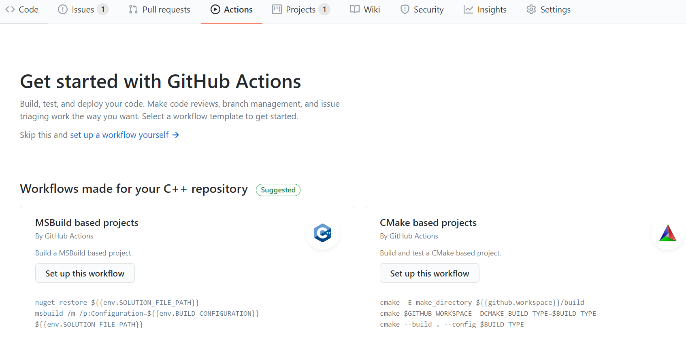
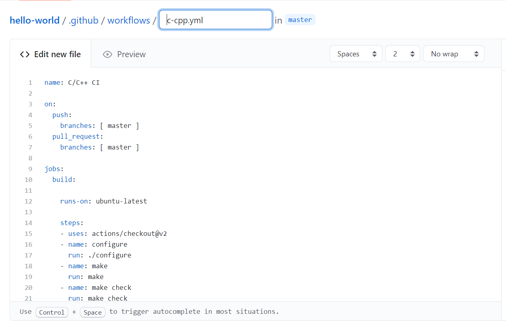
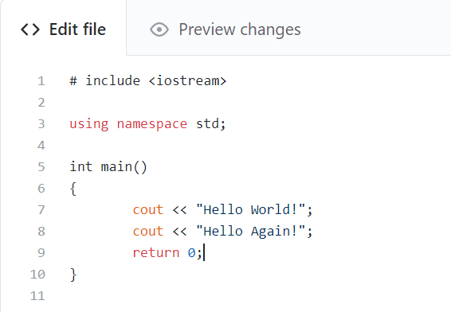
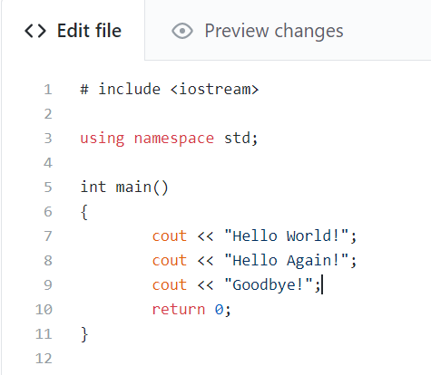
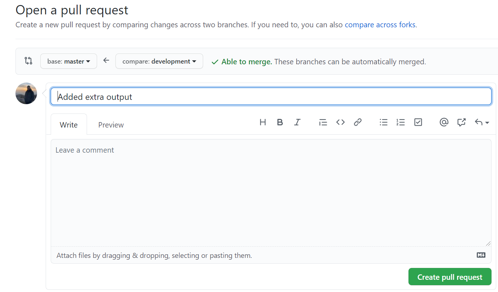
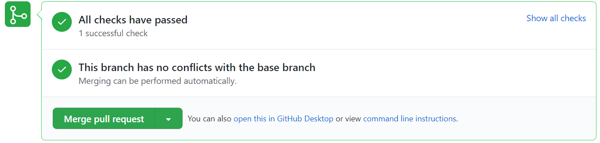
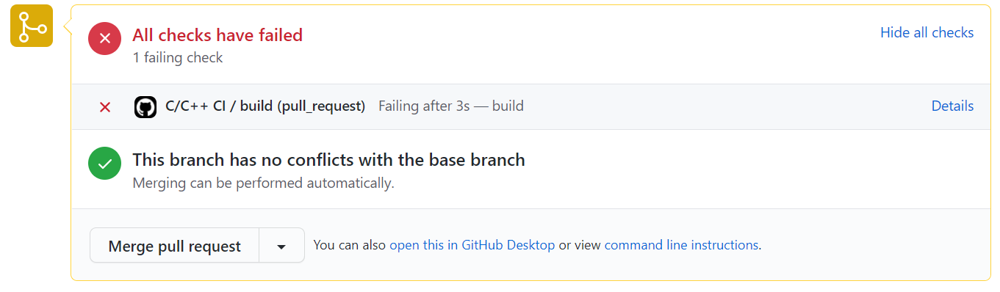

# Level 5 Github Actions <!-- omit in toc -->

## 1. Abstract

This document will walk you through how to set up a Github Action for use in a DevOps environment.
At Level 5, having some flavour of DevOps in your GSDP module would be a nice addition, at this level, we are not expecting a full DevOps pipeline, but having some form of Continuous Integration would be nice to see.

## 2. Table of Contents

- [1. Abstract](#1-abstract)
- [2. Table of Contents](#2-table-of-contents)
- [3. What is a Github Action](#3-what-is-a-github-action)
  - [3.1. Setting up a CI Pipeline with Github Actions](#31-setting-up-a-ci-pipeline-with-github-actions)
- [4. References](#4-references)

## 3. What is a Github Action

Github Actions is a feature in Github for setting up a DevOps pipeline for software development. It allows you to build, test and deploy your code directly from Github, therefore you do not have to go through any other third party software.
Actions offers world-class CI/CD, and is relatively simple to set up. For more information on Github Actions, follow reference [1] to view their official documentation.

As previously mentioned, having some flavour of DevOps in your GSDP module will be nice to see and will impress your clients and tutors. Even setting up a basic CI pipeline will be beneficial to you not only for impressing stakeholders, but it will allow you to create good quality code which can be released rapidly.

If you wish to see more information on DevOps before reading further (recommended), follow this [link](../../../deployment-delivery/level-5/level-5-delivery-guidelines.md) to our documentation on it. It is a very valuable aspect of software development to learn early on in your career and is expected at Level 6 as well.

### 3.1. Setting up a CI Pipeline with Github Actions

I will now show a simple example of how to set up a CI pipeline using **Github Actions**, this example is a basic repository with a 'Hello World' C++ project in it. We will set up a CI pipeline that runs some basic automated tests when merging the **develop** branch with **master**. The CI workflow should be set up **before** you start development:

1. Go to your repository and select **Actions** from the nav bar:

2. You will see that there are many **Workflows** to chose from. Some are CI specific, some are deployment specific (CD). Find a CI workflow for whatever programming language you are using; .NET for C#, Pylint for Python etc. We will choose the recommended workflow **C/C++ with Make** for the C++ program we have in this example. Click **Set up this workflow**:

This might look confusing. The only parts you should pay attention to at this stage is **on: push** and **on: pull_request**. The **jobs** section can be edited to include more tests, the basic version will be enough for us in this example and you shouldn't worry too much about changing this at Level 5. The **on:** section shows when the automated unit tests will run, in our example, they will run when pushing and merging on the master branch.

3. Select the green **Start commit** button at the top, when you are ready. Fill in the fields then select **Commit new file**. The workflow should now be set up and a new .yml file created. You may need to navigate back to **Actions** to click **Enable actions**.

4. Now lets see it in action! Lets make a change in the project. So far, the project looks like this:

Now lets add an extra output, and commit the changes:

5. Create a new **Pull request** to merge **develop** into **master**:

6. Navigate to the pull request, The workflow should now run and perform some automatic tests to check everything is in order. If so, this should appear:

7. If everything is in order, click **Merge pull request**. You can still merge if a test fails, but this is discouraged, and you should check the error to see what test failed and fix it before merging. If a test fails, it should output something similar to this:

You can navigate to the **Checks** tab to see what caused the test to fail.

## 4. References

[1] Github. Automate your workflow from idea to production. <https://github.com/features/actions>.
